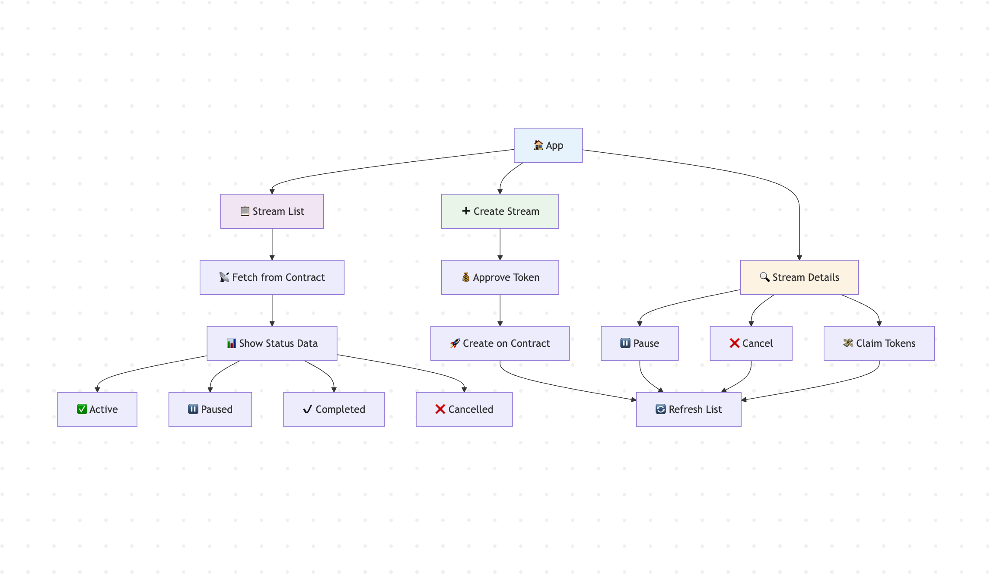
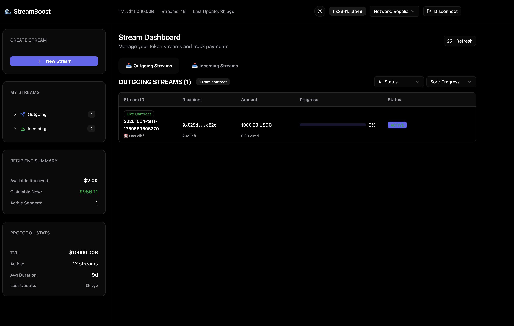

## 1. Main goal

This project aims to create a front-end that integrates with smart contracts using AI (Claude). My goals are threefold: First, to create front-end applications efficiently by leveraging AI capabilities, not only to increase development speed but also to delegate tasks to AI, especially those that would take me considerable time to learn or tasks I am reluctant to do. Second, to prepare for future use cases, such as hackathon projects or other projects requiring front-end development, which can help me save time in development or accomplish tasks I don't have the skills to implement. Third, to practice using AI while understanding its limitations and learning how to use it effectively.

Initially, I didn't have specific business logic for this project. However, from a front-end perspective, there are some common patterns. My thoughts are as follows:

1. Reading logic: retrieve data from smart contracts.
2. Writing logic: send data to smart contracts.
3. Complex data display: such as showing lists of typed data.
4. Workflow visualization: This project demonstrates the steps to create a stream. The workflow logic is tightly integrated with business logic, so it varies across different use cases. In this project, the workflow shows the steps required to create a stream.
5. Other components such as integrating with traditional back-ends; for this project, displaying blockchain status by connecting to RPC endpoints (todo).

## 2. Architecture

### 1. architecture



The application follows a simple three-part flow:

- **Stream List**: Fetches data from blockchain and displays streams with status badges (Active, Paused, Completed, Cancelled)
- **Create Stream**: User workflow for token approval and stream creation on the smart contract
- **Stream Actions**: View details and perform actions (Pause, Cancel, Claim) with automatic list refresh

### 2. Front-end(current only support sepolia network)



[Live Demo](https://smart-contract-frontend-1m1t.vercel.app/)

Demo addresses:

```markdown
Address: 0x26916f19bB4BA63687855c9b6CEfC9D621593e49
Private key: 290ee43772fcb1ad1c75cc5012a1d171844c68827156df6b6573b90f0ec91d47
```

## 3. Process

### 3.1 Business Logic Confirmation

Initially, I didn't have a clear business model and only wanted to implement the front-end features mentioned above. So I asked AI to provide a business model that satisfies these requirements. After multiple conversations with different AI tools, I finally decided to adopt the [design-draft](design-draft.md). The draft was refactored many times, including removing penalty and boost APY logic that AI didn't implement appropriately.

### 3.2 Front-end Design Draft

Returning to the core task, I used the current business model and data structure to create the first draft design in Figma. Based on the [design-draft](design-draft.md), I asked AI to provide front-end design suggestions documented in [figma-design-concept](figma-design-concept.md). Then I used Figma to create the front-end design.

Draft Figma design:
[Draft Figma Design](https://www.figma.com/make/QDPHHU04yXYiwjSxBL7gg0/Dashboard-Layout-Design?node-id=0-4&t=Rd0jeIwtrvzGD3uF-1). As we can see in the initial version, the layout, theme, and basic data structure display satisfied my requirements.

### 3.3 Iterations: Making Basic Features Work

Now it's time to extract the Figma code, which serves as the starting point for the front-end development. Claude checks the related technical stack and makes it work through iterative conversations.
The iteration list can be found below. Obviously, making it work as expected requires many prompts.

[front-end-iterations.md](front-end-iterations.md)

### 3.4 Back-end (Smart Contract Logic Refactor)

Although the initial business logic satisfied my initial requirements, further code review revealed many areas that needed adjustment or removal. Since this project's goal is implementing the front-end, the first priority is to make the smart contract logic as simple as possible. [SMART_CONTRACT_CHANGES.md](https://github.com/sodexx7/smart-contract-frontend/blob/back-end/SMART_CONTRACT_CHANGES.md) shows modifications made during development. [smart-contract-design-draft.md](design-draft.md) is the design specification.

## 4. Tools Used

1. Claude Code
2. Figma
3. [Front-end Technical Stack](Technical-Stack.md)

## 5. Security Considerations

As this is a demo project, I didn't put much attention on security aspects such as RPC URLs and private keys. However, developers should be aware of these sensitive pieces of information when developing production applications.

## 6. Others

### 6.0 The Power of AI-Assisted Coding

1. For certain features, it's extremely efficient to write code or debug. For example, in this project, letting Claude Code adjust styles and display data by querying smart contracts works well within a limited timeframe. The more precise the description, the better the results.

2. Try using other agents alongside Claude Code, such as Playwright agents that check the actual front-end to help Claude Code modify the code.

3. Of course, there are many features related to AI coding. This project only explores limited capabilities. More information can be found in [claude-code-best-practices](https://www.anthropic.com/engineering/claude-code-best-practices).

### 6.1 Features or Issues Not Implemented or Verified

1. Top up functionality
2. Decimal adjustment for USDC
3. Thorough testing (including edge cases) for stream creation and stream detail display
4. Missing footer and other documentation

### 6.2 The Increased Reading Burden of AI-Assisted Coding

Compared to typical coding practices, AI-assisted coding requires extensive reading, checking, and filtering tasks depending on the ultimate goal. It's easy to skip or ignore some content, which can sometimes leave potential problems for the future. However, a solid understanding of each manageable step will limit the risks, albeit at the cost of more time.

### 6.3 Being Aware of AI-Generated Code

There are differences between AI-generated code and human-written code. For example, higher quality human code shows an iterative process, meaning the logic has been verified, tested, and adjusted, while AI code seems perfect at first glance, but reveals more potential issues upon closer inspection. Additionally, the more AI-assisted coding experience one gains, the more intuition develops about working with AI, which helps programmers review AI-generated code more effectively.
